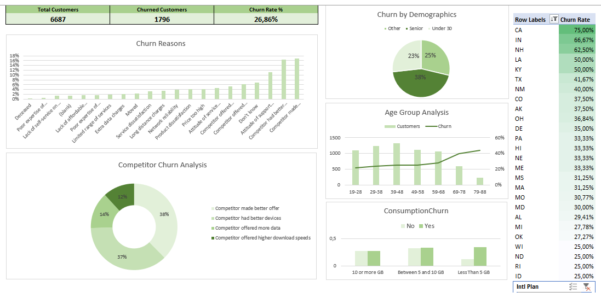

# **Customer Churn Analysis – Excel**

**Excel-based case study showcasing the use of Microsoft Excel to analyze customer churn trends. Covers data cleaning, demographic analysis, churn factors, and actionable insights. Includes churn analysis by age, consumption, and geographical location.**

## **Description**

This project demonstrates how to analyze customer churn using Microsoft Excel. It focuses on identifying key factors contributing to churn, such as customer age, consumption patterns, and geographical regions, and provides recommendations for retention strategies.

**Note:** The dataset used for this analysis cannot be shared publicly due to confidentiality reasons.

## **Project Structure**

- **readme.md**: This file (Markdown format).
- **excel-customer-churn-insights.md**: Detailed case study document (Markdown format).

## **Dashboard Highlights**

Unfortunately, the Excel file cannot be linked interactively, but feel free to explore the analysis through 

.

## **Key Insights & Recommendations**

- **Price Sensitivity**: Customers who churned are highly sensitive to pricing, with 38% leaving due to better offers from competitors.  
- **Senior Customers**: Represent 38% of churn, suggesting the need for targeted retention strategies in this demographic.  
- **Low Data Consumption**: Customers using less than 5GB of data have a higher churn rate, indicating a potential area for retention efforts.  
- **California Region**: Has the highest churn rate at 75%, suggesting a need for regional-specific strategies.

## **Next Steps**

- **Revise Pricing Plans**: Develop more flexible pricing models to cater to price-sensitive customers.  
- **Target Senior Customers**: Create loyalty programs and offers specifically designed for senior customers to reduce churn.  
- **California-Focused Campaigns**: Implement targeted retention campaigns in high-churn regions, such as California.  
- **Enhance Data Plans**: Provide personalized offers for low-data consumption users to increase engagement.

## **Disclaimer**

The data used in this analysis is sourced from DataCamp and is used solely for educational purposes. The analysis, insights, and visualizations provided in this repository are created by the author and are not affiliated with or endorsed by DataCamp. All content in this repository, including the methodology and results, is for personal, academic, and professional development purposes only. The intellectual property rights of the original dataset and any associated content belong to DataCamp.
